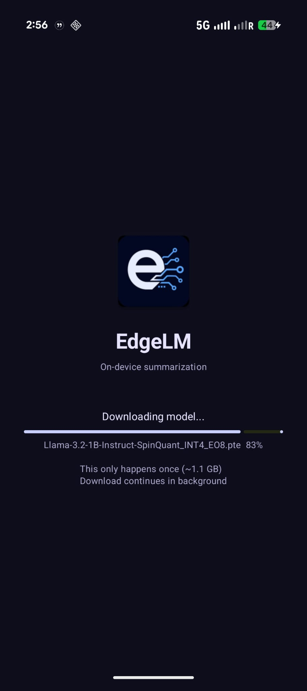
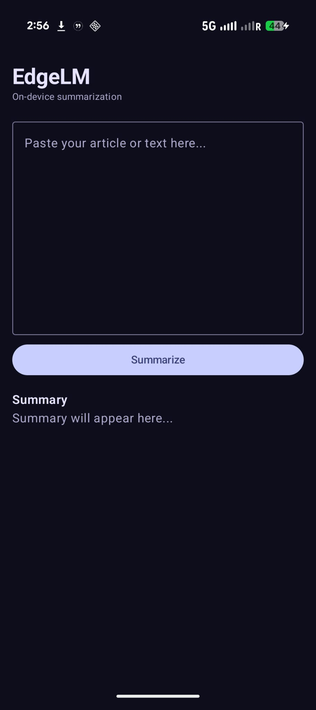
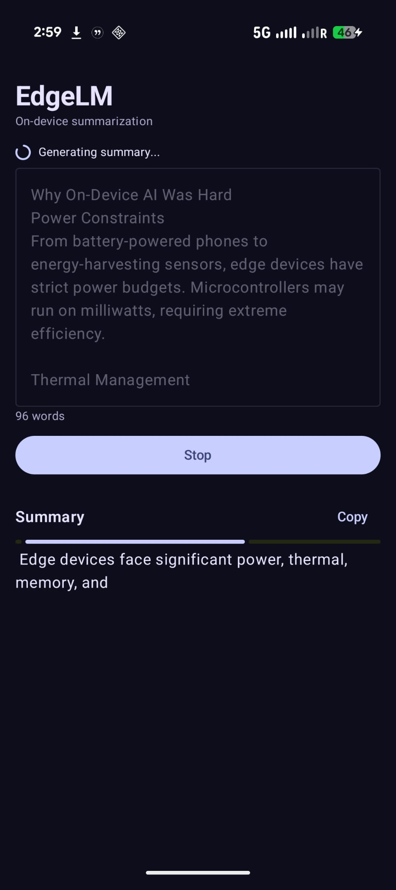
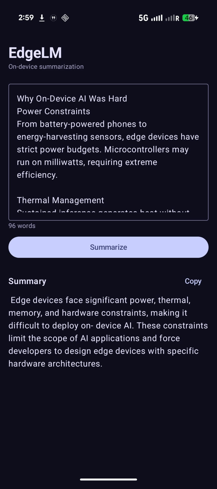
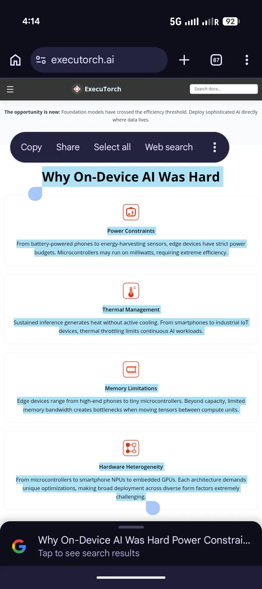
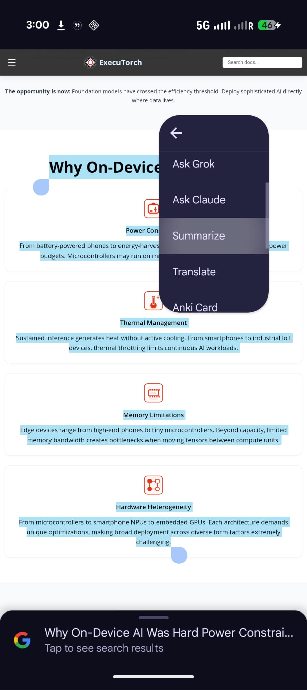
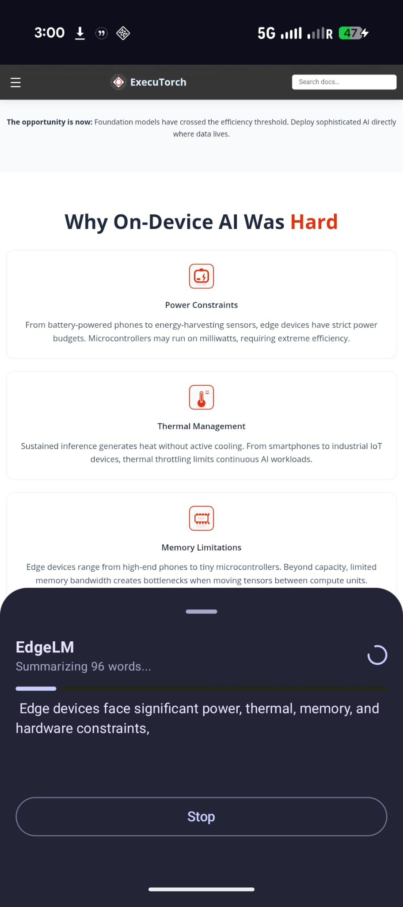
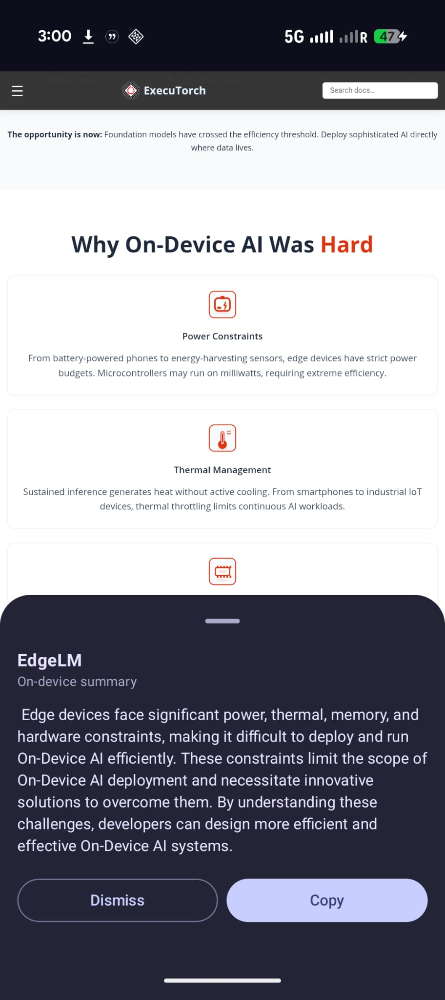

# EdgeLM

**On-device LLM summarization for Android — no cloud, no latency, no data leaving your phone.**

edgelm runs a quantized Llama 3.2 1B model directly on your Android device using Meta's ExecuTorch runtime. Paste any article or select text from any app to get an instant summary — fully offline, fully private.

---

## Screenshots

<table>
  <tr>
    <td align="center"><br/><sub>First launch — model download</sub></td>
    <td align="center"><br/><sub>Main screen</sub></td>
    <td align="center"><br/><sub>Streaming summary</sub></td>
    <td align="center"><br/><sub>Summary complete</sub></td>
  </tr>
  <tr>
    <td align="center"><br/><sub>Select text in Chrome</sub></td>
    <td align="center"><br/><sub>edgelm in system menu</sub></td>
    <td align="center"><br/><sub>Bottom sheet streaming</sub></td>
    <td align="center"><br/><sub>Summary over Chrome</sub></td>
  </tr>
</table>

---

## What it does

- **Standalone summarizer** — paste any text, get a 3-sentence summary in ~5 seconds
- **System-wide text selection** — select text in any app (Chrome, Gmail, Notes), tap edgelm, summary appears as a bottom sheet overlay without leaving the app
- **Fully on-device** — no internet required after first launch, no data sent to any server
- **On-demand model download** — APK is ~15 MB, model downloads once on first launch (~1.1 GB)

---

## Architecture

```
┌─────────────────────────────────────────────────────────┐
│                     Export Pipeline                      │
│                                                          │
│  meta-llama/Llama-3.2-1B-Instruct                       │
│         ↓ SpinQuant INT4 quantization                    │
│  Llama-3.2-1B-Instruct-SpinQuant_INT4_EO8.pte           │
│         ↓ hosted on HuggingFace (public)                 │
│  Downloaded to device on first launch                    │
└─────────────────────────────────────────────────────────┘
                          ↓
┌─────────────────────────────────────────────────────────┐
│                    Android Runtime                       │
│                                                          │
│  LlmModule (ExecuTorch 1.2.0)                           │
│         ↓ loads .pte from filesDir                       │
│  LlamaRunner.kt                                          │
│    → truncateInput() — word limit enforcement            │
│    → generate() — streams tokens via LlmCallback         │
│    → section detection — stops at bullet points          │
│    → safeComplete() — guards double completion           │
│         ↓                                                │
│  SummarizerViewModel.kt — StateFlow UI state             │
│         ↓                                                │
│  MainActivity / ProcessTextActivity                      │
└─────────────────────────────────────────────────────────┘
                          ↓
┌─────────────────────────────────────────────────────────┐
│                   Entry Points                           │
│                                                          │
│  App launcher → MainActivity                             │
│    Full-screen input/output UI                           │
│                                                          │
│  ACTION_PROCESS_TEXT → ProcessTextActivity               │
│    Transparent Activity + ModalBottomSheet overlay       │
│    Auto-summarizes on arrival, no extra tap needed       │
└─────────────────────────────────────────────────────────┘
```

---

## Performance

Measured on **Google Pixel 10** with Llama 3.2 1B SpinQuant INT4:

| Metric | Value |
|---|---|
| Prefill speed | 150–220 tok/s |
| Decode speed | 20–25 tok/s |
| Time to first token | 0.5–1.2s |
| Total time (80 words input) | ~4–5s |
| Model size | 1.14 GB (INT4 quantized) |
| Memory (RSS) | ~1,500 MiB |
| Context window | 2,048 tokens |
| Max input | 200 words (~260 tokens) |

**Paper benchmark** (OnePlus 12, Snapdragon 8 Elite): 50.2 tok/s decode, 260.5 tok/s prefill. Pixel 10 uses Tensor G4 which explains the difference.

---

## Known Limitations

**Text selection compatibility**
`ACTION_PROCESS_TEXT` works in apps that explicitly support 
third-party text actions. Currently confirmed working:

- Chrome ✅
- Any app using standard Android TextView ✅

Apps that do not support it use custom text selection 
implementations and must explicitly opt in — this is 
outside EdgeLM's control.

**Model size**
The model downloads ~1.1 GB on first launch. This requires a stable
internet connection and sufficient storage. Wi-Fi recommended.

**Decode speed**
~20-25 tok/s on Pixel 10 (Tensor G4). Devices with Snapdragon 8 Elite
such as Samsung Galaxy S25 Ultra achieve ~50 tok/s per the ExecuTorch
paper benchmarks.

**Input limit**
Maximum 200 words per summarization request. Longer inputs are
truncated automatically.

---

## Key Technical Findings

**ExecuTorch 1.2.0 API change**
LLM classes moved to `org.pytorch.executorch.extension.llm` — not documented at the time of development. Discovered by inspecting `classes.jar` inside the AAR directly.

**MAX_TOKENS semantics**
ExecuTorch's `generate(prompt, maxTokens, callback)` treats `maxTokens` as total sequence length (prompt + output), not output-only tokens. Setting `maxTokens = 1024` gives ~760 output tokens for a 266-token prompt.

**KV cache reset**
ExecuTorch accumulates `pos_` across `generate()` calls on the same `LlmModule` instance. After 2-3 runs the context fills up and generation produces 0 tokens. Fixed by recreating `LlmModule` before each call — `load()` uses mmap so it's near-instant.

**Context window**
Model metadata reports `get_max_context_len = 2048`. ExecuTorch calculates `max_new_tokens = maxTokens - prompt_tokens` which means input length directly reduces output budget.

---

## Stack

| Component | Technology |
|---|---|
| Model | Llama 3.2 1B Instruct |
| Quantization | SpinQuant INT4 (8da4w, group size 32) |
| Runtime | ExecuTorch 1.2.0 Android |
| Language | Kotlin |
| UI | Jetpack Compose + Material3 |
| Architecture | MVVM + StateFlow |
| Min SDK | API 26 (Android 8.0) |
| Target device | ARM64 Android |

---

## Project Structure

```
edgelm/
├── android/summarizer/app/src/main/java/com/example/edgelm_summarizer/
│   ├── MainActivity.kt          — standalone summarizer UI
│   ├── ProcessTextActivity.kt   — transparent Activity for text selection
│   ├── SummarizerViewModel.kt   — MVVM ViewModel, StateFlow state
│   ├── LlamaRunner.kt           — ExecuTorch inference wrapper
│   └── ModelDownloader.kt       — first-launch model download
├── export/
│   ├── export_model.py          — export to .pte via Optimum ExecuTorch
│   └── validate.py              — HuggingFace reference summarization
└── docs/
    ├── benchmarks.md            — Pixel 10 performance data
    └── screenshots/             — app screenshots
```

---

## Build & Run

**Prerequisites**
- Android Studio Hedgehog or later
- Android device running API 26+ (ARM64)
- ~2 GB free storage on device for model

**Steps**

```bash
# Clone
git clone https://github.com/harishcmuthyala/edgelm.git
cd edgelm/android/summarizer

# Build and install
.\gradlew installDebug        # Windows
./gradlew installDebug        # Mac/Linux
```

On first launch the app downloads the model (~1.1 GB) from HuggingFace. This happens once — subsequent launches go straight to the summarizer.

**Model files** are not included in the repo or APK. They are downloaded automatically:
- `Llama-3.2-1B-Instruct-SpinQuant_INT4_EO8.pte` — 1.14 GB
- `tokenizer.model` — 2.1 MB

Source: [executorch-community/Llama-3.2-1B-Instruct-SpinQuant_INT4_EO8-ET](https://huggingface.co/executorch-community/Llama-3.2-1B-Instruct-SpinQuant_INT4_EO8-ET)

---

## Roadmap

| Phase | Status | Description |
|---|---|---|
| Phase 1 — Export & Validate | ✅ Done | Export pipeline, reference validation |
| Phase 2 — Summarizer App | ✅ Done | Android app with streaming inference |
| Phase 3 — Text Selection | ✅ Done | ACTION_PROCESS_TEXT system integration |
| Phase 4 — Polish & Benchmark | 🔄 In Progress | Benchmarks, on-demand download, demo |

---

## References

- [ExecuTorch: An End-to-End Solution for On-Device Inference](https://arxiv.org/abs/2605.08195) — MLSys 2026
- [ExecuTorch Android Docs](https://pytorch.org/executorch/stable/using-executorch-android.html)
- [Llama 3.2 Model Card](https://huggingface.co/meta-llama/Llama-3.2-1B-Instruct)
- [SpinQuant: LLM quantization with learned rotations](https://arxiv.org/abs/2405.16406)

---

## License

MIT — see [LICENSE](LICENSE)